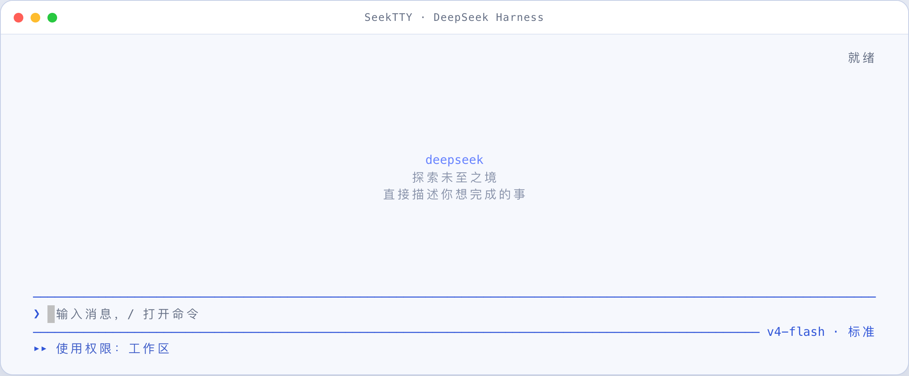
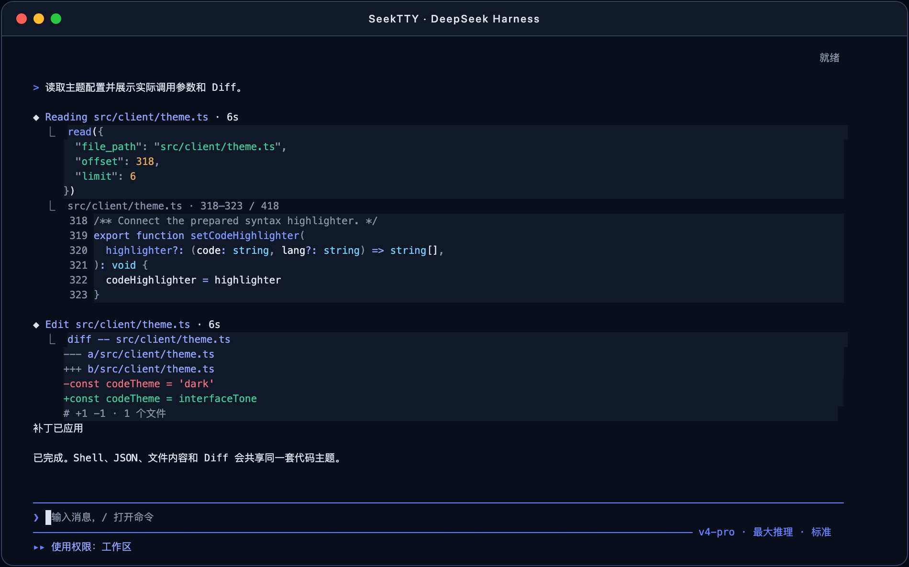

<div align="center">


<h1>TAD</h1>

<p>DeepSeek Harness 的键盘优先终端工作台，陪你把一个想法推进到可执行方案。</p>

<p>
  <a href="https://github.com/Hilbert-beinghappy/seektty/releases"></a>
  
  
  <a href="https://github.com/Hilbert-beinghappy/seektty/actions"></a>
  <a href="LICENSE"></a>
</p>

<p>
  <a href="#项目概览">项目概览</a>
  ·
  <a href="#clarify-与-plan">Clarify 与 Plan</a>
  ·
  <a href="#已经接入的-harness-能力">终端能力</a>
  ·
  <a href="#快速开始">快速开始</a>
  ·
  <a href="#已验证范围">验证</a>
</p>

<p><a href="README.md">English</a> · 中文</p>

</div>

---

## 项目概览

进入项目目录运行 `deepseek`，就能在一个终端工作台里使用 [DeepSeek Harness](https://github.com/deepseek-ai/deepseek-harness) 原生的 Agent、Session、模型、权限、Settings、Profile、插件与持久化能力。提问、代码修改、工具调用、会话管理、模型路由、权限切换、插件、子 Agent 和运行诊断都落在同一套 Harness 状态上。

想法还没有写完整时，可以进入由插件提供的 `/clarify` 工作流：Clarify 读取当前 Session 与输入区草稿，沿真实模型路由逐题生成苏格拉底式问题、上下文选项和 live Draft preview。每回答一题，预览稿都会吸收新的决定。采用后，完整 Draft 回到普通输入框，等你审阅、修改并自行发送。需求明确之后，再用 Harness 原生 `/plan` 把它写成实施方案。

[Clarify Host 插件](https://github.com/Hilbert-beinghappy/dsh-plugin-clarify) 持有绑定 Session 的澄清进程、模型生成的问题、选项、预览稿和六方法 Remote。兼容的插件能力激活后，TAD 会自动探测它，并加入本地 `/clarify` 命令与键盘优先的 TUI 界面。TAD 把当前 Session 和草稿交给插件，再把用户采用的 Draft 写回输入框。

Clarify 的模型调用由 [Auxiliary Runtime](https://github.com/Hilbert-beinghappy/dsh-plugin-auxiliary-runtime) 承接，用量写入独立的 `auxiliary_runtime` 账本。官方 Agent 循环继续使用 `tokenUsage`；快照合同健康时，TAD `/status` 分别展示来源清楚的 Official、Auxiliary 和派生 Combined 总量。

## DeepSeek 亮色与暗色界面

### 亮色主题



### 暗色主题


最新视图会铺满终端，并让输入框与状态栏始终沉在底部。未使用的行属于中间的对话视口，会随着输出增长逐行收缩；更长的对话继续进入终端原生滚动记录。

## Clarify 与 Plan

[Clarify](https://github.com/Hilbert-beinghappy/dsh-plugin-clarify) 是可选的 DeepSeek Harness Host 插件，TAD 是它的键盘优先终端消费者。插件提供的 Clarify 与 Harness 原生 Plan 位于同一条工作流的前后两段。

Clarify 处理“要做什么还需要问清”的阶段。它根据当前 Session 和草稿一次提出一个聚焦问题，把已经确认的决定带入后续问题，并在每一答之后更新可审阅的 Draft。采用后，这份 Draft 回到输入框；你可以继续改字，在它准确表达真实意图时按 Enter 发送。

Plan 处理“需求已经明确、需要决定怎么做”的阶段。Harness 原生 `/plan` 把已经提交的需求整理为实施方案，并进入正常的计划审查流程。

### `/clarify` 来自哪里

| 组件 | 职责 |
| --- | --- |
| **TAD** | 探测 Clarify Remote，动态把 `/clarify` 加入本地命令目录，渲染终端交互，提供当前 Session 与输入草稿，并把采用后的 Draft 写回输入框。 |
| **dsh-plugin-clarify** | 通过 `clarify.wire/1` 发布 `start`、`answer`、`accept`、`refine`、`cancel` 和 `fetchDraft`，持有临时澄清进程，生成问题、选项与持续演进的 Draft preview。 |
| **dsh-plugin-auxiliary-runtime** | 为 Clarify 提供同进程模型执行、限额、取消和来源独立的辅助用量。 |

TAD 单独运行时展示核心命令目录；两个 Host 插件在同一 Profile 激活后，命令目录会扩展出完整的 `/clarify` 工作流。

```text
[当前 Session + 输入草稿]
              |
              v
     +------------------+      clarify Remote      +------------------+
     | TAD 消费端   | -----------------------> | Clarify 插件     |
     | /clarify 适配器  | <----------------------- | 进程 / 模型生成  |
     +--------+---------+   live Draft preview     +--------+---------+
              |                                            |
              |                                            | 同进程 run
              |                                            v
              |                                   +-------------------+
              |                                   | Auxiliary Runtime |
              |                                   | 限额 / 取消       |
              |                                   | 独立用量账本      |
              |                                   +---------+---------+
              |                                             |
              |                                             v
              |                                   [官方模型路由]
              |                                   transcript 外、无工具
              |
              | 采用：Draft 回到输入框
              v
          [审阅与修改]
              |
              | 按 Enter
              v
       [正式 Session 消息]
              |
              | 需要实施方案时运行 /plan
              v
       [计划审查 -> Agent 执行]

Auxiliary snapshot ---------------------> TAD /status
                                          Official | Auxiliary | Combined
```

### 主 Session 对话记录

问题、选项、预览稿变化和 refine 反馈保留在 Host 内存中的临时澄清进程里，默认 15 分钟无交互后进入 `stale`，并返回 `staleReason=ttl-expired`。主 Session transcript 在你正式发送采用后的 Draft 时才写入这条用户消息。澄清状态与 input queue、pending、Plan、Goal、Profile 文件和 TAD 本地文件相互分离。

### 辅助模型用量

每一次 Clarify 模型调用都由 Auxiliary Runtime 记入官方 `storageDomain` 下的 `auxiliary_runtime` 域。官方 `tokenUsage` 继续表示 Agent 循环调用。Combined 在读取时按四个互不重叠的 Token 桶相加。辅助账本保存调用标识、purpose、状态、Token 桶、规范化失败和时间戳；prompt、消息正文、模型输出、自定义回答、凭据和文件路径不会进入账本。

### 从输入框启动插件提供的 Clarify

`dsh-plugin-clarify` Host 插件暴露兼容的六方法 Remote 与 `clarify.wire/1` 后，TAD 会把 `/clarify` 加入本地命令目录。最近一次联合验收 Release 仍安装 Clarify `0.2.1`；`0.2.0` 保留为已发布回滚工件。未发布三件套 TAD `1.2.1` + Auxiliary Runtime `0.1.1` + Clarify `0.2.2` 已有 Lane A 无 key PTY 证据，以及 2026-08-22 在 `candidate4` 上的 Lane B live-provider 观察。这不是 Release，也不是完整联合验收。详见 [已验证范围](#已验证范围)。

- 从命令面板执行：保留整个输入区作为 seed。
- 输入 `/clarify some text`：以参数文本作为 seed。
- 在现有草稿末尾单独加入 `/clarify` token 或一行：以前面的草稿作为 seed。

每次回答都会刷新 live Draft preview。提问数量跟随当前 Session 中尚未确认的关键决定：Clarify 通常一次只追问一个聚焦问题，预览已经可发送时直接进入审阅。你可以继续回答、直接 refine 当前预览、采用或放弃。采用会把审阅后的 Draft 写入普通输入框，按 Enter 仍是明确的发送动作。

## 界面与代码主题自定义，并可导入 VS Code 主题

主题能力是 TAD 的核心特色：界面背景与文字颜色可自定义，代码块的背景、文字、语法高亮及粗体／斜体可独立自定义，`/theme import` 可导入本地 VS Code JSON/JSONC 主题并保留可移植的 TextMate Token 配色；还可以输入 3–16 个颜色，自动生成一套可预览、可继续调整的亮色或暗色主题。

### DeepSeek 亮色界面中的 TypeScript


### DeepSeek 暗色界面中的工具参数、文件读取与 Diff



Markdown 围栏会直接渲染成连续代码色块。助手代码、Shell 指令、结构化工具参数、文件读取、JSON 和 Diff 使用同一套代码主题，普通对话文字仍保持界面样式。每块代码背景都连续覆盖真实终端单元格，不会出现逐行断开的横纹。

## 已经接入的 Harness 能力

当前版本覆盖以下能力：

| 能力 | 当前可用操作 |
| --- | --- |
| 对话与运行 | 流式回复、Markdown/GFM、不显示围栏的主题语法高亮代码色块、链接、表格、推理显示切换、工具卡片折叠/展开/隐藏、模型重试、上下文压缩、最大输出与错误状态、Ctrl+C 停止当前轮次 |
| 会话 | 新建、恢复、列表、全文搜索、重命名、Fork、归档、复制最后一条回复、导出 ZIP，或 `/export md` 导出 Markdown |
| 工作区 | 从当前目录启动，添加、选择、重命名、移除注册、调整工作区顺序和工作区内会话顺序；移除注册不会删除目录、文件或会话日志 |
| Agent 模式 | 支持 Standard、Code/PTC、Minimal、Cordis/Create 四种基线模式，并动态显示插件注册的新 Agent Preset；活跃会话切换模式时在同一工作区创建新会话 |
| 模型与 Provider | 动态读取 Provider、模型和模型支持的推理强度，显示当前实际路由，切换当前会话模型，并报告目录、凭证和路由错误 |
| 权限与审批 | 查看和切换只读、工作区、完全访问等 Host 权限；Shift+Tab 快速循环；进入高风险权限前确认；工具调用支持仅本次允许、本会话不再询问或拒绝 |
| 输入队列与 Steer | Agent 运行时继续排队消息，查看、编辑、删除队列项，将单条或整队消息转为当前轮次引导，并可直接发送 `/steer` |
| 人机交互 | 处理单选、多选、自定义回答、跳过、取消和计划审查；提交后自动回到最新输出并展示原轮次续答，失败时可通过 `/pending` 重试 |
| 图片附件 | 直接粘贴图片或图片路径，或用 `/attach` 加入 PNG、JPEG、GIF、WebP；macOS 用系统剪贴板（osascript，可选 pngpaste），Linux 用 wl-paste/xclip，Windows 用 PowerShell；待发送图片显示在输入框下方；按当前 Host 动态 `imageLimits` 目录检查数量、字节、像素和可选边长；终端支持时内联显示，否则显示文件名、尺寸、类型和大小。能否理解图片由同一份动态模型目录决定。官方 dsh `0.1.1-rc.2` 的 Vision-Exp 必须在 `/model` 里显式选择。Lane A 已观察到目录可见且可选择；Lane B 在 `candidate4` 上已观察 PNG 发送即清附件，以及经官方 Host 转 PNG variant 的 JFIF。详见 [已验证范围](#已验证范围) |
| Plan、Goal、Todo 与压缩 | 使用 Harness 原生 `/plan`、`/goal`、`/compact` 命令，显示计划审查、目标状态、Todo 数量和上下文压缩记录 |
| 工具与产出文件 | `◆ 操作 · 耗时` 标题、运行中同步计时及带连接符的调用代码、动态工具目录、工具参数与安全边界说明、带原文件行号的高亮读取、Shell／JSON／Diff 高亮、安全保留的终端 ANSI、通用降级卡片；按轮次查看本会话生成文件、在 TUI 内查看、复制绝对路径，并在确认后交给外部程序打开 |
| 子 Agent | 查看直接子 Agent、运行状态、树结构、Token 和耗时；打开可继续会话或只读会话，并在运行时停止当前子 Agent 轮次 |
| 后台任务与工作流 | 查看 Jobs 的类型、状态、开始/结束时间、耗时和详情；在 Transcript 中显示工作流阶段、成员、结果和失败状态 |
| 统计与轨迹 | 每轮显示步骤数、LLM/工具耗时、首 Token、吞吐率、缓存命中和输入/输出 Token；检查模型请求、运行中工具与结构化 Trajectory |
| Profile | 查看、创建、复制和切换 Profile，诊断终端兼容性；受控重启会恢复工作区、会话、未发送草稿和附件 |
| 设置与凭证 | 没有可用 Provider 时提供首次 API Key 引导；枚举当前 Profile 注册的全部 Settings；专用处理默认模型、默认权限、默认 Agent 模式和插件来源，其余字段通过 Schema 通用控件编辑；Secret 只写不回显 |
| 插件与市场 | `/plugin` 插件中心、已安装列表、搜索、详情、安装、删除、更新、Bundle 排序、来源管理和诊断；支持 npm、Git、tarball 与本地路径安装 |
| Skills 与 MCP | 动态列出当前可调用 Skills 并插入原生命令；查看 MCP 工具、实例、设置、加载状态和独立进程/远端服务风险 |
| 反馈 | 记录会话反馈；对 Assistant 回复提交好评、差评和可选说明，也可删除已有消息反馈 |
| 状态与诊断 | 查看 Harness、Node、平台、Profile、工作区、会话、模式、模型、权限、pnpm、插件运行状态及诊断信息 |
| 主题 | 界面主题与代码块主题独立；自动模式下代码颜色跟随 DeepSeek 暗色／亮色；支持命名自定义主题、手动配色、输入 3–16 个颜色自动生成，以及本地导入 VS Code JSON/JSONC 并保留 TextMate 颜色和可移植 Token 样式；实时预览、对比度警告、终端颜色降级和 `NO_COLOR` |
| 界面语言 | 通过 `/language` 在中文和英文之间实时切换；显式偏好通过官方 `locale.preference` Settings 与 Harness Web 共用，`auto` 则跟随终端语言环境 |

模型、Provider、Agent Preset、权限、Host 命令、工具、Settings、Skills、MCP 和插件来源都从当前 Harness 运行时读取。上游或第三方 Bundle 注册新能力后，TAD 会将它加入动态目录；需要专用界面的能力也保留 Schema、结构化详情和错误诊断入口。

## 快速开始

三个仓库与 GitHub Releases 均已公开。最近一次联合验收的 Clarify 工作流仍是官方 DeepSeek Harness `0.1.0-rc.8`，搭配 TAD `1.2.0`、Auxiliary Runtime `0.1.0` 和 Clarify `0.2.1`。先通过原生 `dsh plugin` 安装这些已经发布的 tarball：

```sh
pnpm add --global @deepseek-ai/dsh@0.1.0-rc.8

dsh plugin --profile tui add https://github.com/Hilbert-beinghappy/seektty/releases/download/v1.2.0/seektty-1.2.0.tgz
dsh plugin --profile tui add https://github.com/Hilbert-beinghappy/dsh-plugin-auxiliary-runtime/releases/download/v0.1.0/dsh-plugin-auxiliary-runtime-0.1.0.tgz
dsh plugin --profile tui add https://github.com/Hilbert-beinghappy/dsh-plugin-clarify/releases/download/v0.2.1/dsh-plugin-clarify-0.2.1.tgz

dsh --profile tui
```

这条路径直接使用打包产物，可以避开 Git 源的 `prepare` / `allowBuilds`。第一项安装 TAD 终端壳，第二项提供 Auxiliary 模型执行，第三项提供 Clarify Host 服务与 Remote。两个 Host 插件在同一 Profile 激活后，TAD 会发现 Remote，并把 `/clarify` 加入终端命令目录。

TAD `1.2.1` 当前已测官方 `0.1.1-rc.2`。未发布三件套 TAD `1.2.1` + Auxiliary Runtime `0.1.1` + Clarify `0.2.2` 已有 Lane A 无 key PTY 证据，以及 2026-08-22 在 `candidate4` 上的 Lane B live-provider 观察。这不是 Release，也不是完整联合验收。详见 [已验证范围](#已验证范围)。现在还没有 `v1.2.1` Release 资产；请用本地 `pnpm pack` 的 tarball 安装这个候选，或等到 https://github.com/Hilbert-beinghappy/seektty/releases 列出未来 Release。不要编造下载 URL。

### 裸 `deepseek` 启动器

TAD 支持 macOS、Linux 和 Windows。全局安装同一份 Release tarball；Windows 使用 `pnpm add --global` 后可以解析 PATHEXT 下的 `dsh.cmd` shim。

```sh
pnpm add --global https://github.com/Hilbert-beinghappy/seektty/releases/download/v1.2.0/seektty-1.2.0.tgz
export SEEKTTY_SPEC=https://github.com/Hilbert-beinghappy/seektty/releases/download/v1.2.0/seektty-1.2.0.tgz
deepseek
```

PowerShell 使用同一 URL：

```powershell
pnpm add --global 'https://github.com/Hilbert-beinghappy/seektty/releases/download/v1.2.0/seektty-1.2.0.tgz'
$env:SEEKTTY_SPEC='https://github.com/Hilbert-beinghappy/seektty/releases/download/v1.2.0/seektty-1.2.0.tgz'
deepseek
```

`deepseek` 需要 PATH 上的 `dsh`，也可以用 `DSH_BIN` 指向可执行文件。`SEEKTTY_SPEC` 会让 Profile 始终使用同一份预构建 tarball；没有这项覆盖时，本源码树的默认规格是 `github:Hilbert-beinghappy/seektty#v1.2.1`，该 Git tag 只在 Release 打出后才存在。在此之前请先 `pnpm pack` 得到 `seektty-1.2.1.tgz`，并把 `SEEKTTY_SPEC` 指到该文件。后续运行直接启动同一 Profile。它支持初始任务、工作区、会话恢复和自定义 Profile：

```sh
deepseek "检查这个项目"
deepseek --cwd ../project
deepseek --resume
deepseek --resume <sessionId>
deepseek --profile team-tui
deepseek --version
deepseek --update
```

`deepseek --update` 会强制扫描，但每轮只安装一个许可组件。默认 `SEEKTTY_UPDATE=auto`：启动时拉取官方 dsh 的 npm `latest`（只用于发现，不跟 `next` 或 GitHub 预发布）和 TAD 最新 GitHub Release。TAD 自更新优先，本轮不再装 dsh。否则仅当 `latest` 落在 peer 对齐的自动范围（legacy rc.6–rc.8，或当前精确已测 Host）且新于**已安装**的 `dsh --version` 时才安装 dsh。future / gap Host（例如 `0.1.1-rc.1`）只提示、不安装。`DSH_BIN` 固定可执行文件时跳过 dsh。本地 `link:`/`file:` 安装和 `SEEKTTY_SPEC` 覆盖不会被改写。网络或安装失败不会挡住启动。设 `SEEKTTY_UPDATE=check` 可改回会话后提示，设 `SEEKTTY_UPDATE=0` 可关闭。

## 首次配置 API Key

如果当前 Profile 没有任何可用模型 Provider，并且 DeepSeek 官方 Provider 暴露的凭证引用尚未配置且允许写入，TAD 会在首个界面帧出现前打开居中的只写输入框。启动环境已有凭证、Harness 凭证存储已有值，或存在使用环境认证／无 Key 认证的其他活跃 Provider 时，都不会弹出引导。

### 暗色首次引导


### 亮色首次引导


这里只粘贴 API Key 本身。输入内容始终显示为掩码；按 Enter 后，规范化后的值会直接交给 Harness `credentials.set`。TAD 不会读回密钥，也不会自行写凭证文件，更不会把它放进 Settings、日志、截图或 Session 数据。保存时不会主动发起可能计费的在线验证请求；Key 是否有效由第一次真实模型请求通过 Harness Provider 的原生错误路径报告。

按 Esc 可以稍后配置，同时继续进入 `/settings`、`/plugin` 等本地界面。之后发送普通消息、Skill 命令或带附件消息时会再次打开同一引导。`deepseek "初始任务"`、已经提交的文字和草稿附件都不会丢失：保存成功后自动继续原请求，再次跳过则恢复到输入框。Provider 检查不可用、官方适配器缺席或凭证层只读时，TAD 直接提示使用 `/settings` 与 `/doctor`，并保留 Harness 原有行为。

## 斜杠命令

在输入框键入 `/` 会打开可搜索的命令与 Skill 菜单。菜单会合并 TAD 命令、当前 Agent 注册的 Host 命令和用户可调用的 Skills。

| 分类 | 命令 |
| --- | --- |
| 会话 | `/new`、`/resume`、`/sessions`、`/rename`、`/fork`、`/archive`、`/export`、`/export md`、`/copy` |
| 工作环境 | `/workspace`、`/profile` |
| Agent | `/mode`、`/model`、`/permission`、`/plan`、`/goal`、`/compact` |
| 运行交互 | `/queue`、`/steer`、`/attach`、`/attachments`、`/pending` |
| 运行内容 | `/tools`、`/files`、`/jobs`、`/subagents`、`/trajectory` |
| 扩展 | `/plugin`、`/plugins`、`/skills`、`/mcp` |
| 插件工作流 | 当前 Profile 中的 `dsh-plugin-clarify` 及其 Auxiliary Runtime 依赖激活后出现 `/clarify` |
| 配置与诊断 | `/settings`、`/language`、`/theme`、`/status`、`/doctor`、`/feedback`、`/restart`；当最近一次联合验收的 Auxiliary Runtime `0.1.0` 或当前 `0.1.1` 候选健康可用时，`/status` 分别显示标明来源的官方、辅助和组合（派生）会话总用量，且不修改官方 `tokenUsage` 投影 |
| 帮助与退出 | `/help`、`/quit`、`/exit` |

`/plugin`、`/workspace` 和 `/profile` 既有完整的交互中心，也支持直接子命令。未知命令会给出相近候选，不会被当成普通消息发给模型。TAD 探测 Clarify 插件兼容的六方法 Remote 与 `clarify.wire/1`，再把 `/clarify` 动态加入本地 `/` 目录。插件生成的问题、上下文选项和持续演进的预览稿会引导你得到一份进入普通输入框的 Draft；何时发送由你决定。完整旅程见 [Clarify 与 Plan](#clarify-与-plan)。

## 常用交互

| 输入 | 操作 |
| --- | --- |
| 鼠标左键拖动，再按终端复制快捷键 | 使用终端原生选区复制当前可见的任意 TUI 文字（macOS 使用 `Command+C`；Linux 和 Windows 终端通常使用 `Ctrl+Shift+C`） |
| 鼠标滚轮 / 触控板 | 输入框保持激活时浏览终端原生滚动记录 |
| `/` | 打开命令与 Skill 候选 |
| Enter / Shift+Enter | 发送或确认 / 输入换行 |
| Tab / Escape | 在输入区与 Transcript 间切换 / 返回输入区或关闭当前弹窗 |
| PgUp / PgDn / Home / End | 浏览 Transcript 时翻页、跳到最早或回到最新内容 |
| Shift+Tab | 循环当前权限，进入完全访问前确认 |
| Shift+Left / Shift+Right | 跳到上一个或下一个用户轮次 |
| F1 | 打开应用内帮助 |
| Ctrl+P | 打开完整命令面板 |
| Ctrl+M | 支持扩展键盘协议时打开模型选择器 |
| Ctrl+S | 打开会话恢复选择器 |
| Ctrl+O / Ctrl+T | 切换工具卡片显示 / 显示或隐藏推理内容 |
| F2 / Ctrl+, / Cmd+, | 打开设置 |
| Ctrl+C | 停止当前轮次、清空草稿，或二次确认退出 |

## 从 deepseek-tui 迁移

旧版全局包只需替换一次；新的 `deepseek` 启动器会通过原生 `dsh plugin` 命令把目标 Profile 中的旧 Bundle 标识替换为 `seektty`：

```sh
pnpm remove --global deepseek-tui
pnpm add --global https://github.com/Hilbert-beinghappy/seektty/releases/download/v1.2.0/seektty-1.2.0.tgz
export SEEKTTY_SPEC=https://github.com/Hilbert-beinghappy/seektty/releases/download/v1.2.0/seektty-1.2.0.tgz
deepseek
```

自定义 Profile 在首次启动时分别迁移，例如 `deepseek --profile team-tui`。只使用 dsh 原生入口时，可显式执行：

```sh
dsh plugin --profile tui remove deepseek-tui
dsh plugin --profile tui add https://github.com/Hilbert-beinghappy/seektty/releases/download/v1.2.0/seektty-1.2.0.tgz
```

## 直接插拔

移除不会修改 dsh 本体，只会让 Bundle 离开目标 Profile：

```sh
dsh plugin --profile tui remove seektty
```

重新安装使用相同命令：

```sh
dsh plugin --profile tui add https://github.com/Hilbert-beinghappy/seektty/releases/download/v1.2.0/seektty-1.2.0.tgz
```

安装结果直接写入目标 Harness Profile 的依赖、Bundle 顺序和 pnpm lockfile。TUI 的 `/plugin` 与原生 `dsh plugin` 操作同一份 Profile 状态。

## 插件中心

裸 `/plugin` 打开当前 Profile 的插件中心，`/plugins` 是同一入口。直接子命令包括 `list`、`search`、`info`、`install`、`remove`、`update`、`reorder`、`source` 和 `doctor`。

- 默认从 npm Registry 搜索，可增加 JSON/HTTP Catalog，也能读取其他 Harness Bundle 注册的来源；
- 安装输入支持 npm 包名、Git 地址、tarball、file URL 和本地目录；
- 安装前检查 `dsh.bundle.patch`、包内文件、最终安装 spec、构建脚本和目标 Profile；
- 安装、删除、更新和排序完成后可立即重启，重启会恢复当前工作区、会话、草稿和附件；
- 插件详情会显示版本、来源、发布者、Bundle 状态、加载顺序和可执行诊断。

## 模型、设置与主题

`/model` 从 Harness 动态读取 Provider、模型和推理强度，选择完成后立即刷新输入框右下角的实际模型状态。`/mode` 管理 Agent Preset，`/permission` 管理当前会话权限；三者各自独立。

`/settings` 会列出当前 Profile 注册的全部设置命名空间。默认模型、默认权限、默认 Agent 模式和插件来源使用专用选择器；布尔、枚举、数字、文本、JSON、Secret 和 Credential Ref 等其他字段由 Schema 通用界面处理。界面同时显示继承值、用户覆盖、重置操作以及立即生效或重启生效状态，写入时使用 revision 防止覆盖并发修改。Secret 只显示是否已配置，输入时不会回显。

TAD 的终端界面同时提供中文和英文。`/language` 会打开语言选择器，也可以直接输入以下命令快速切换：

```text
/language auto
/language zh
/language en
```

语言选择由官方 `@deepseek-ai/dsh-client-locale` Host 插件存储在 `locale.preference`，因此 TUI 与 Harness Web 共用同一个显式偏好。`auto` 会删除显式覆盖：TAD 依次检查 `LC_ALL`、`LC_MESSAGES`、`LANGUAGE` 和 `LANG`，浏览器则继续使用自己的平台语言回退。切换会立即重建终端边框和对话呈现，不会改写模型、工具、用户、Provider 或插件提供的原始内容。

TAD 默认使用 DeepSeek 暗色主题。`/theme` 打开完整主题中心，内置主题和命名自定义主题也可以直接管理：

```text
/theme dark
/theme light
/theme code [auto|dark|light|<主题名>]
/theme use <主题名>
/theme edit [主题名]
/theme palette [主题名]
/theme import [主题名] [本地文件]
/theme delete <主题名>
```

界面主题与代码块主题彼此独立。`/theme light`、`/theme dark` 和 `/theme use <主题名>` 会选择暗亮方向一致的完整界面／代码组合。使用 `/theme code auto` 时，代码背景、正文、语法颜色和暗亮方向都跟随当前界面主题，因此 DeepSeek 亮色界面使用亮色代码块；`/theme code dark`、`/theme code light` 或 `/theme code <主题名>` 只覆盖代码呈现，直到再次选择完整界面主题。`/theme edit` 编辑完整命名主题，`/theme palette` 接收 3–16 个 HEX/RGB 颜色并生成暗色与亮色候选方案。

`/theme import` 读取本地 VS Code JSON/JSONC，递归解析相对 `include`，映射编辑器颜色与语义 Token，并保留可移植的 TextMate 前景、背景、粗体、斜体、下划线和删除线规则。导入后只切换代码主题，不会覆盖当前界面主题。所有自定义路径保存前都会进入实时预览。低对比度颜色不会被静默修改；预览会标出问题角色并要求再次确认。

自定义主题覆盖终端画布、面板、选中状态、正文、边框、品牌色、状态色、代码背景与正文，以及注释、关键字、字符串、数字、常量、函数、类型、变量、属性、参数、运算符、标点、标签、属性名和正则表达式等语法角色。助手 Markdown 代码、Shell 指令、结构化工具参数、文件读取、JSON 和 Diff 共用同一套代码主题。工具调用显示为紧凑的操作／耗时标题，下一行使用 `⎿` 连接调用代码；工具运行时从 Harness 调用时间开始同步计时，结束后停在最终耗时。折叠状态保留调用内容，展开状态再增加结果。常用语法随启动加载，其他支持的语法按需加载并原地重绘。切换主题会立即重新着色已有消息，不会改变当前滚动位置、展开状态或未发送草稿。

界面选择、独立代码选择与命名定义都保存在 `seektty-appearance` Harness Settings 命名空间中，并使用 revision 保护写入，因此 `/settings` 也能通过 Schema 通用界面编辑同一份数据。主题名不区分大小写且不可重复；覆盖与删除都必须确认。删除正在使用的界面主题会切回 DeepSeek 暗色，删除正在使用的代码主题会恢复自动搭配。VS Code 的字体族和字号不会导入，因为字符网格字体由终端统一控制；导入的粗体、斜体等样式只作用于代码 Token，不会改变普通中文、英文、系统文字或工具标题。

## 已验证范围

- 官方 stock `@deepseek-ai/dsh@0.1.0-rc.8` 隔离安装、配置装配和 PTY 启动；并对声明的最低版本 `@deepseek-ai/dsh@0.1.0-rc.6` 完成 add／boot／remove／re-add 插拔契约。
- TAD `1.2.1` 当前在壳、单测和 typecheck 层面对官方 `@deepseek-ai/dsh@0.1.1-rc.2`。Lane A（2026-08-21，未修改 stock `0.1.1-rc.2`、隔离 `DSH_HOME`、真实 PTY、未发布 TAD `1.2.1` + Auxiliary Runtime `0.1.1` + Clarify `0.2.2`）：`/doctor` 0 error / 0 warning、99 plugins running；`/status` 健康；`/clarify` 路由到 Auxiliary 后无 key 返回 `MISSING_CREDENTIAL` 且保留 composer；Vision-Exp 可见且可选择；PNG 附件 `/restart` 成功恢复。丢失源文件恢复：单测保证失败文案只用 basename、覆盖两种通知顺序、绝对路径不进文案；真实 PTY hardcopy/可见区扫描只检出 ASCII basename `vision-logo.png`，未检出 `private/tmp`、`/tmp`、`Users`、`Volumes`。不能证明关闭无 key onboarding modal 后该 restore error 仍持续显示（Esc 也会清 notice）。Lane B（2026-08-22，未修改 stock `0.1.1-rc.2`、隔离 `DSH_HOME`、`candidate4`）：已显式选择 Vision-Exp；PNG image-only 发送成功、发送即清附件并识别 logo，但纯图无问题导致模型又调用 `read_image`；真实 JFIF JPEG 经 TAD 入队、官方 Host 正常转 PNG variant 后，无工具 OCR 成功；Clarify 经 Auxiliary 完成 6 轮动态问答、41 行完整审阅、二次确认 accept 回 composer 且不自动发送；`/status` 显示官方／辅助／组合用量；895 文件扫描 secret literal 为 0。这不是 Release，也不是完整联合验收。未证明 Web UI、GIF/WebP、超限拒绝、JPEG 原字节直通、PNG 完全不靠工具、本轮中断恢复、成本／缓存 A/B。
- 最近一次联合验收 Release 组合：Clarify `0.2.1`、TAD `1.2.0`、Auxiliary Runtime `0.1.0` 与官方 dsh `0.1.0-rc.8`。Clarify `0.2.1` 保持 `0.2.0` 的六方法 Remote、`clarify.wire/1` 和精确 rc.8 兼容边界。
- Clarify `0.2.0` live-provider 联合验收覆盖真实模型动态生成问题／选项／preview、多轮 preview 演进、审阅采用后只写回输入框并由用户自行发送、中断恢复、用量来源和隐私检查。
- Clarify `0.2.1` 发布后无 Key 验收重新下载并核对三包 Release 资产，在 stock rc.8 Profile 完成 add／boot／remove／re-add，`/doctor` 为 0 错误／0 警告、99 个插件运行，随后进入 `running`、路由到 Auxiliary，并按隔离环境预期返回 `MISSING_CREDENTIAL`。`0.2.1` 尚未重跑 live-provider 动态多轮，也没有 cache／cost A/B。
- 历史独立 Clarify lifecycle 证据覆盖官方 dsh rc.6／rc.7／rc.8；完整动态生产边界仍是精确 rc.8 与 Auxiliary Runtime `0.1.0`。
- Auxiliary 调用的 usage／limits／cancel 持久化在 `auxiliary_runtime` 存储域。官方 Agent `tokenUsage` 保持原有归属；可选快照合同健康时，`/status` 展示经过校验的 Official、Auxiliary 和派生 Combined 桶。
- 模型列表、Provider／模型／推理强度切换、请求提交和 Harness 错误透传。
- 隔离 `DSH_HOME` 下的首次 Provider 就绪检查、API Key 掩码输入、跳过后的草稿恢复、Harness 凭证持久化，以及重启后不再提示。
- 暗色、亮色及配色生成主题的真实 PTY 渲染，界面／代码主题独立即时切换，80／120／160 列布局，以及同一 Profile 重启后的主题恢复。
- 中英文语言解析、带 revision 保护的共享偏好写入、终端实时切换，以及未知外部内容保持原样。
- 原生 remove 后依赖、Bundle 和配置条目全部消失；re-add 后再次启动成功。
- 全新打包后的全局安装在没有工作区开发依赖、也没有重复 `@deepseek-ai/*` 包的情况下，依然能暴露裸 `deepseek`，自动创建 `tui` Profile，并通过官方 dsh 模块回退完成启动。
- 安装后已完成真实原生 `todo_write` 用户旅程；打包门禁还会拒绝 Profile 内出现官方身份型 Host 包的副本，并验证 Cordis、API proxy、Session 和工具运行时都解析到官方回退实例。
- macOS、Linux 和 Windows 均支持安装、启动、键盘导航与终端交互。

已在隔离 `DSH_HOME` 中把有效 DeepSeek 凭据粘贴进真实掩码引导并完成在线多轮验收：`v4-flash` 首轮返回 `REALCHECK_58597`，下一轮引用该结果后返回 `REALCHECK_58598`。同一 Profile 重启后没有再次弹出引导，Harness 凭证文件权限为 `0600`，凭据没有进入终端输出、截图或仓库；验收结束后已删除隔离凭证存储。

可复用的 stock-dsh 插拔检查：

```sh
DSH_BIN=/path/to/dsh \
SEEKTTY_SPEC=/path/to/seektty.tgz \
pnpm test:stock
```

可复用的跨包 doctor 检查：

```sh
CLARIFY_SPEC=/path/to/dsh-plugin-clarify.tgz \
pnpm test:clarify-doctor
```

## 兼容和升级

当前已测 Host 是官方 `0.1.1-rc.2`。壳声明的最低 Host 仍是官方 `0.1.0-rc.6`，legacy lifecycle 覆盖 rc.6／rc.7／rc.8。最近一次联合验收的 Clarify + Auxiliary 生产组合仍是精确 `0.1.0-rc.8`，搭配 TAD `1.2.0`、Auxiliary Runtime `0.1.0` 和 Clarify `0.2.1`。未发布三件套 TAD `1.2.1` + Auxiliary Runtime `0.1.1` + Clarify `0.2.2` 已有 Lane A 无 key PTY 证据，以及 2026-08-22 在 `candidate4` 上的 Lane B live-provider 观察；这不是 Release，也不是完整联合验收（详见 [已验证范围](#已验证范围)）。新于 `tested` 的 dsh 仍可启动 TAD 并给出提示；旧于 TAD `minimum` 的 Host 会被拒绝。updater 以实际已装的 `dsh --version` 判断，TAD 自更新优先，每轮只安装一个组件，future / gap Host 不装。发布的 Bundle 通过 optional peer 描述 Host 合同，运行时 import 统一从官方 `$DSH_HOME/profiles/node_modules` 回退解析，让原生工具调度器等身份型 Symbol 保持唯一。官方回退缺少的纯客户端辅助包会进入 Bundle。Host 插件 `seektty/attachment-compat` 紧挨在 `api-gateway` 之前，只适配精确的合法遗留 image-limit 能力形状；其他形状闭包失败。未来 Host 按能力匹配。定时工作流扫描官方 npm `latest` dist-tag，在 `pnpm run check`、隔离打包启动器和 stock-dsh 契约通过后，升级精确开发基线和 optional peer 范围并开 pull request；npm `next` 与 GitHub Harness 预发布留在发现轨道之外。

源码仓库与 GitHub Releases 均公开。用户包通过对应 Release 附带的预构建 tarball 分发，当前没有 npm Registry 发布。
